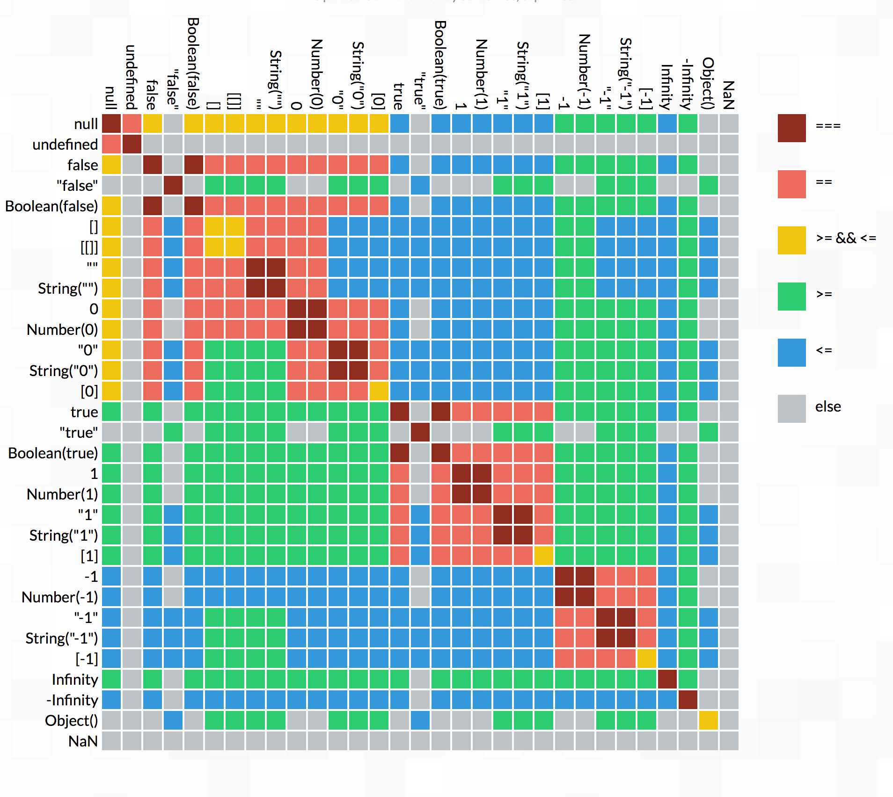

# 常用概念：


## 声明式渲染：

vue.js的核心在于`模板`语法，可以使用简洁的模板语法声明式的把数据渲染到DOM系统之中。

```vue
<template>
	<div id="app">
	{{message}]
	</div>
</template>
<script>
	var app = new Vue({
		el:"#app",
		data:{
			message:"hello vue"
		}
	})
</script>
```

> 类似于JSP页面的 JSTL语法， ${variable}在这里变换成了 {{variable}} 效果都是相似的。

## 指令
> 指令前缀带有 `v-` 标志，例如 `v-bind`,一旦加上了指令，就代表他们会渲染DOM上应用特殊的响应式行为。

例如:
```html
<div id="demo" v-bind:title="message"> 绑定当前DOM元素的title信息与message保持一致</div>
<script>
	var app2 = new Vue({
	  el: '#demo',
	  data: {
	    message: '页面加载于 ' + new Date().toLocaleString()
	  }
	})
</script>
```
上述代码的含义为： #demo的title属性会跟随 message对象的数据的变化来变化。一旦发现message的对象有变化，即会发生变化。

注意：有的同学可能会误以为， new Date()返回的是当前的时间，而当前的时间是不停的变化的，所以 new Date()也在不停的变化，既然如此，message会不会是在不停地变化呢？既然如此，岂不是v-bind:title会不停地因为new date()变化而变化。

**message: new Date()方法返回的数据只会在调用的时候才调用（也就是new  Vue()的过程)，虽然时间在不停地变化，但是由于获取时间的方法没有被反复调用，所以message属性也不会有变化。**


## v-if 指令控制元素是否可见(是否存在于DOM树)
> 注意：这里所说的元素是否可见，是指dom元素节点是否存在，为了区分元素显示和隐藏的概念，我决定添加后缀(是否存在于DOM树)

用法： 根据表达式的值的真假条件渲染元素。在切换时元素及它的数据绑定 / 组件被销毁并重建。如果元素是 <template> ，将提出它的内容作为条件块。

###  表达式的值为 true/false，如果我传递其他值会有什么问题么？
没有问题，实测true/false是会控制 vue的指令的正确处理，但是JavaScript是一个神奇的语言，会有各种各样的变量混入其中，所以我大致测试了几个变量以供参考。
1.  undefined --> 认为是false
2.  null -->认为是false
3. object/1/"1" 等常见对象 -->认为是true

所以，这个表达式是 符合JavaScript真值表的。也就是说，只要你写的表达式返回的是JavaScript的真值，就认为是true。

---------------------------------------

如果看不懂上面的图，可以参照：[MDN中JavaScript被认为是真的值](https://developer.mozilla.org/zh-CN/docs/Glossary/Truthy)

```html
<div id="app3">
	<span v-if="isSeen">现在你可以看到我了</span>   
</div>
<script>
	var app3 = new Vue({
	  el: '#app3',
	  data: {
	    seen: true
	  }
	})
</script>
```
如果你希望元素消失不见，我们可以 修改seen的属性
```javascript
	app3.seen = false
```

## v-else 指令控制元素是否可见
用法： 前一个兄弟元素必须有v-if v-else-if指令。

--------------------
当 随机数>0.5的时候，就会出现 `你可以看到我` 字样。否则出现`你看不到`字样。
```html
<div v-if="Math.random() > 0.5">
    你可以看到我
</div>
<div v-else>
	你看不到
</div>
```

## v-else-if
用法： 前一个兄弟元素必须有v-if v-else-if指令。

如果等于A则展示A,否则，如果是B，则展示B，否则如果是C。则展示C。否则就 A/B/C.
```html
<div v-if="type === 'A'">
  A
</div>
<div v-else-if="type === 'B'">
  CIX
</div>
<div v-else-if="type === 'C'">
  C
</div>
<div v-else>
  Not A/B/C
</div>
```
类似于下面的逻辑：
```javascript
function demo(type) {
  if(type === "A"){
  	return "A"
  }else if (type == 'B'){
  	return "B"
  }else if(type == "C"){
  	return "C"
  }else {
  	return "NOT A/B/C"
  }
}

```
## v-for 
预期数据： Array | Object | number | string

用法：基于源数据多次渲染元素或模板块。此指令之值，必须使用特定语法 `alias in expression`，为当前遍历的元素提供别名：

> alias(别名) expression(表达式)
```html
<div v-for="item in items">
  {{ item.text }}
</div>
```